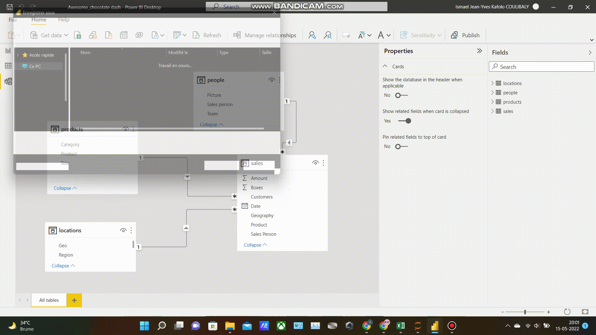

# Awesome_chocolate-Sales-Analysis
## Overview
Basic analysis and dashboard building  of a fictionnal company
the purpose is highlithing commercials performence and overall selling profits of the company
## Data configuration 
  

## Demo
  

# Keys visuals and filters 

- A table showing all the commercials along with their photos and names
- count of sales  by geography
- evolution of sales over the time
- forecasting of custommers No and sales amount over time

## Filters
The dashboard is interactive according to the selection  of these features :
- Team name (each commercials is associated to a team)
- Date 
- commercial itself
- category of product
- No of chocolate boxes sold

## KPI 
Only one  KPI was used which is 
the sum of sales 
